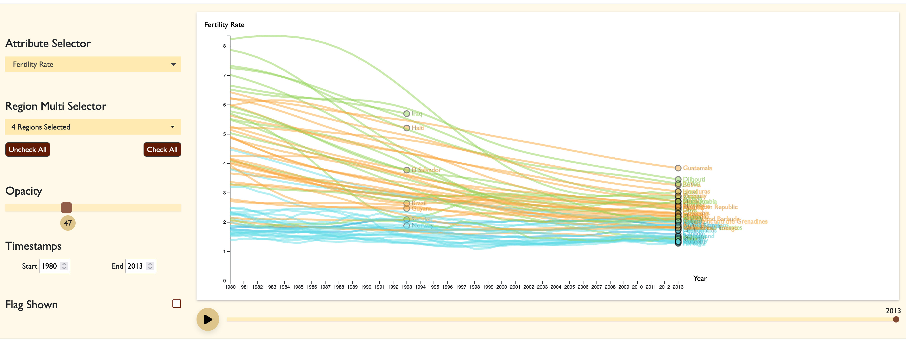
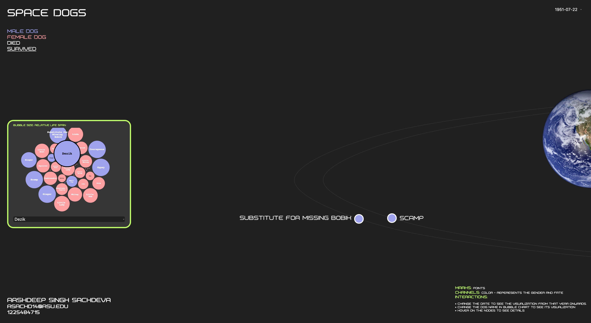

This project is associated with Arizona State University, released under CSE 578: Data Visualization course. I have provided overview of this individual project. For access to the complete source code, please contact me at my [email](mailto:asroideva@gmail.com) address.

In the repository, I am providing overview of 2 projects alongside their demos to showcase my work in Data Visualization course.

---

# 1. Global Development Visualization

## Overview
The project aims to develop an interactive data visualization of the global development dataset obtained from the World Bank, spanning the years 1980 to 2013. Using a combination of D3, Javascript, Bootstrap, CSS, and HTML, the goal is to create a **dynamic multi-line chart** that updates based on user-selected countries and attributes. The dataset includes diverse information on urban development, agriculture, rural development, health, and infrastructure across different countries and geographic locations.

## Dataset
- Global Development from CORGIS Dataset Project: [Dataset](https://corgis-edu.github.io/corgis/csv/global_development/)

## Tools used
- [D3.js](https://d3js.org/): A JavaScript library for creating dynamic, interactive data visualizations in the web browser.
- [Bootstrap](https://getbootstrap.com/): A popular CSS framework for building responsive and mobile-first websites.

## Links
- [Global Development Live Demo](https://dataviz-globaldevelopment.netlify.app/)

---
# 2. Space Dogs Custom Innovative Visualization

## Overview
This project showcases my custom made visualization that is not part of any standard library. In the visualization, it showcases the fate of the soviet dogs in space while they were on mission. It's a dynamic and interactive user experience where they can choose a specific year and see the space shuttle revolving in action.

## Dataset
- [Soviet Space Dogs](https://www.airtable.com/universe/expG3z2CFykG1dZsp/soviet-space-dogs)

## Links
- [Space Dogs Visualization Live Demo](https://dataviz-innovative.netlify.app/)

